#  Openfort 7702 Delegator Smart Contract Benchmarks

This benchmark suite provides comprehensive performance analysis of Openfort's EIP-7702 delegator smart contract across multiple blockchain networks. The benchmarks measure gas consumption, transaction costs, and performance characteristics for various operations including deployment, initialization, key registration, token transfers, and batch executions.

## EIP-7702 Delegator Contract
Openfort's 7702 delegator smart contract implements account abstraction features that enable:

- Account Delegation: EOAs can delegate execution to smart contract logic
- Sponsored Transactions: Third-party gas payment (account abstraction)
- Session Keys: Temporary authentication for improved UX
- Batch Operations: Multiple operations in a single transaction
- Advanced Signatures: Support for P256 and other signature schemes

##  Benchmark Categories
- Deploy Smart Contract
- Initialize Account
- Register-Key
- ERC20 Operations
- Native Transfer
- Batch Execution

#### Full Benchmark Report
[Full Report](/test/Output/enhanced-benchmark-report.md) | [Benchmarks Report](/test/Output/benchmark-report.md)

#### Benchmarks for EVM Networks
[Ethereum Mainnet](/test/Output/mainnet-benchmark-report.md) | [Base Mainnet](/test/Output/base-benchmark-report.md) | [Arbitrum Mainnet](/test/Output/arbitrum-benchmark-report.md) | [Optimism Mainnet](/test/Output/optimism-benchmark-report.md)

#### Comperison Benchmarks (aa-benchmarks)
**Disclaimer: We have prepared a comparison report between the Openfort 7702 Account and a standard Smart Contract Account (AA).**
[Ethereum Mainnet](test/Output/Comparison/ethereum.md) | [Base Mainnet](test/Output/Comparison/base.md) | [Arbitrum Mainnet](test/Output/Comparison/arbitrum.md) | [Optimism Mainnet](test/Output/Comparison/optimism.md)

  
Generated: 7/28/2025, 4:35:19 PM

## Gas Usage Summary

| Test                       | MAINNET   | BASE      | ARBITRUM  | OPTIMISM  |
| -------------------------- | --------- | --------- | --------- | --------- |
| Deploy OPF                 | 5,001,063 | 5,002,249 | 5,007,503 | 5,012,809 |
| Initialize TX              | 356,932   | 356,932   | 356,932   | 356,932   |
| Initialize + Session Key   | 658,262   | 658,262   | 658,262   | 658,262   |
| Register EOA               | 222,841   | 222,841   | 222,841   | 222,841   |
| Register P256              | 302,442   | 302,442   | 302,442   | 302,442   |
| Register P256 (Non-Extrac) | 302,442   | 302,442   | 302,442   | 302,442   |

## Cost Comparison (USD)

| Test                       | MAINNET | BASE   | ARBITRUM | OPTIMISM |    Best      |
| -------------------------- | ------- | ------ | -------- | -------- | ------------ |
| Deploy OPF                 | 16.4848 | 0.1279 | 1.5451   | 0.0238   | **OPTIMISM** |
| Initialize TX              | 1.1765  | 0.0089 | 0.1101   | 0.0014   | **OPTIMISM** |
| Initialize + Session Key   | 2.1698  | 0.0165 | 0.2031   | 0.0025   | **OPTIMISM** |
| Register EOA               | 0.7345  | 0.0056 | 0.0687   | 0.0008   | **OPTIMISM** |
| Register P256              | 0.9969  | 0.0076 | 0.0933   | 0.0011   | **OPTIMISM** |
| Register P256 (Non-Extrac) | 0.9969  | 0.0076 | 0.0933   | 0.0011   | **OPTIMISM** |

## Openfort Benchmarks

## Openfort Benchmarks — Slides (README Pager)

> Tip: For a real slider, see GitHub Pages: https://openfort-xyz.github.io/7702-Benchmark/

### Slide 1 / 14
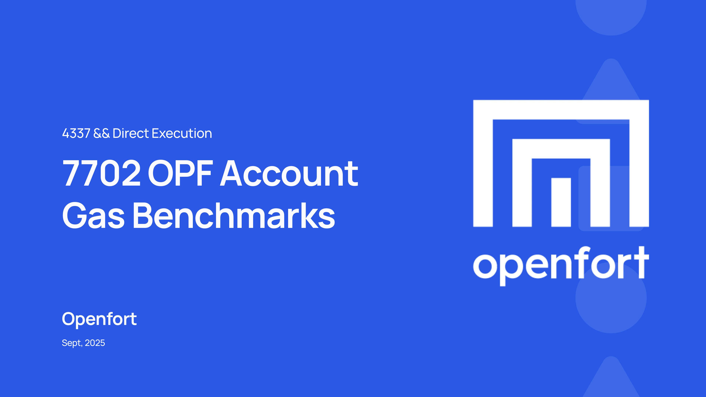

<a href="#slide-2">Next ➜</a>

---

### Slide 2 / 14
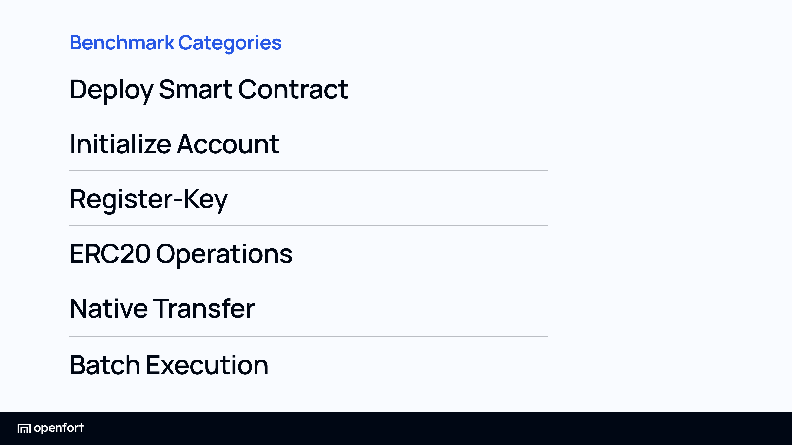

  <a href="#slide-1">⬅ Prev</a> · <a href="#slide-3">Next ➜</a>

---

### Slide 3 / 14
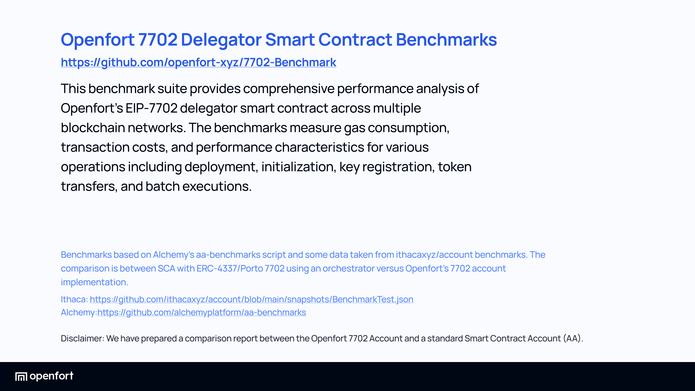

<a href="#slide-2">⬅ Prev</a> · <a href="#slide-4">Next ➜</a>

---

### Slide 4 / 14
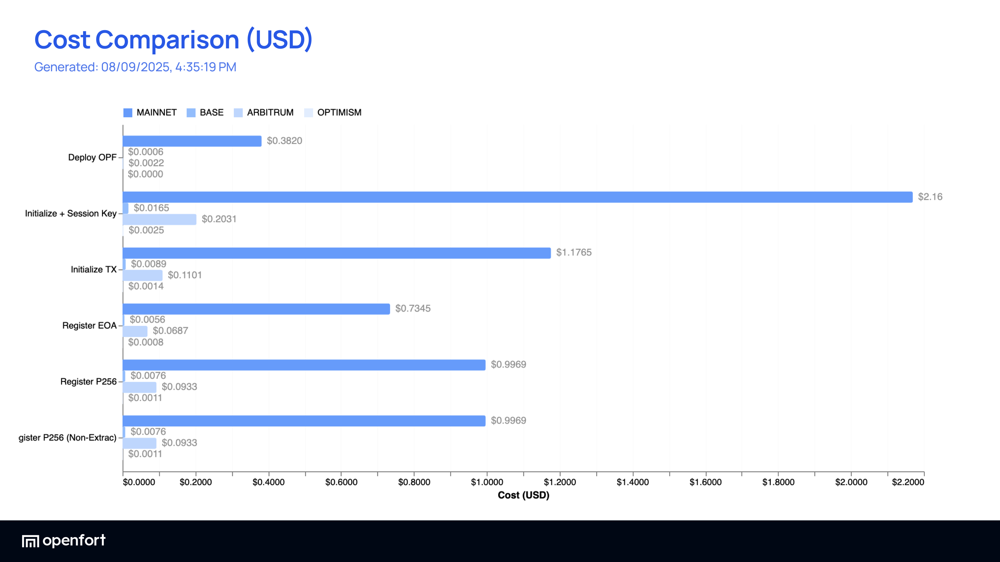

<a href="#slide-3">⬅ Prev</a> · <a href="#slide-5">Next ➜</a>

---

### Slide 5 / 14
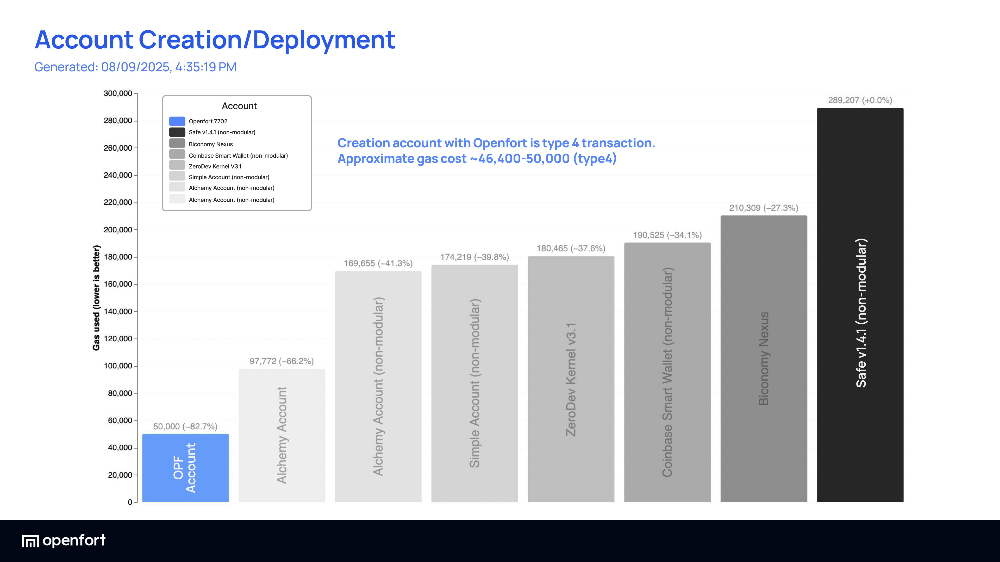

<a href="#slide-4">⬅ Prev</a> · <a href="#slide-6">Next ➜</a>

---

### Slide 6 / 14
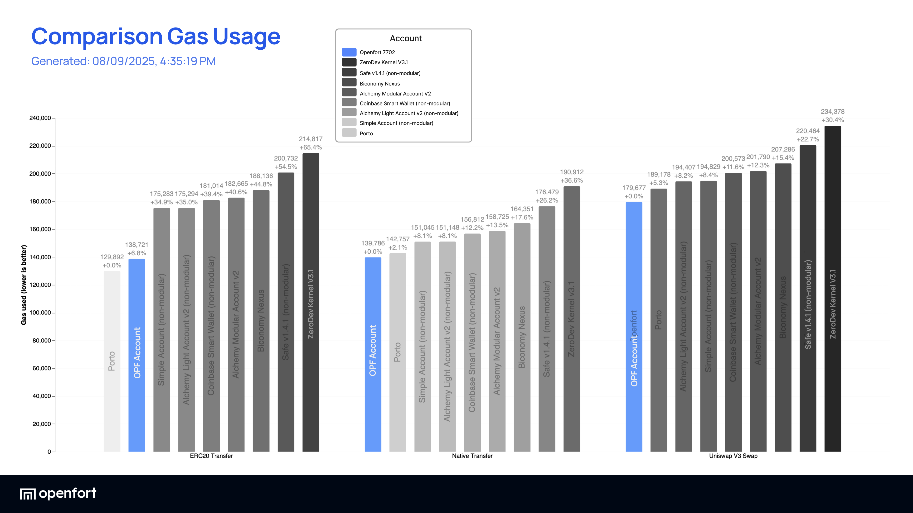

<a href="#slide-5">⬅ Prev</a> · <a href="#slide-7">Next ➜</a>

---

### Slide 7 / 14
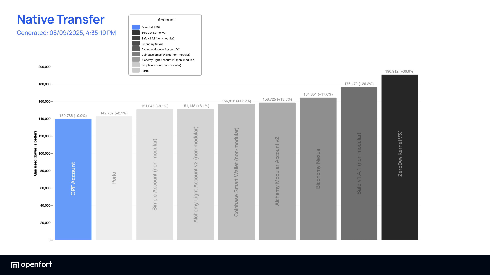

<a href="#slide-6">⬅ Prev</a> · <a href="#slide-8">Next ➜</a>

---

### Slide 8 / 14

<a href="#slide-7">⬅ Prev</a> · <a href="#slide-9">Next ➜</a>

---

### Slide 9 / 14
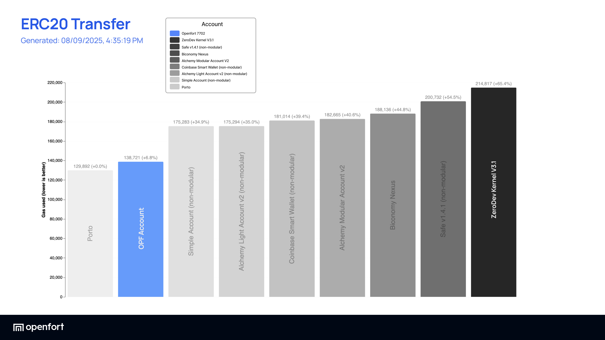

<a href="#slide-8">⬅ Prev</a> · <a href="#slide-10">Next ➜</a>

---

### Slide 10 / 14

<a href="#slide-9">⬅ Prev</a> · <a href="#slide-11">Next ➜</a>

---

### Slide 11 / 14
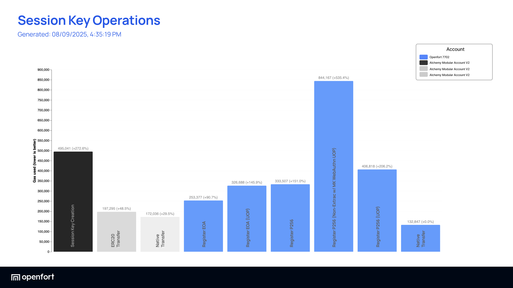

<a href="#slide-10">⬅ Prev</a> · <a href="#slide-12">Next ➜</a>

---

### Slide 12 / 14
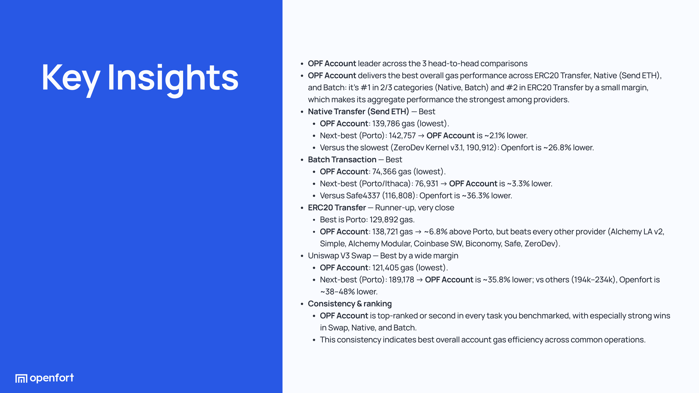

<a href="#slide-11">⬅ Prev</a> · <a href="#slide-13">Next ➜</a>

---

### Slide 13 / 14
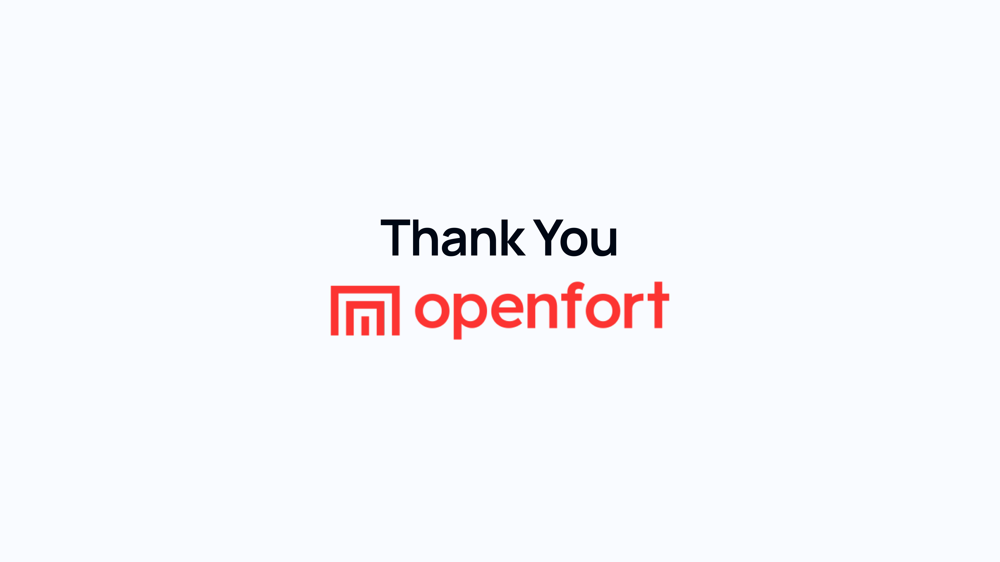

<a href="#slide-12">⬅ Prev</a> · <a href="#slide-14">Next ➜</a>

---

### Slide 14 / 14
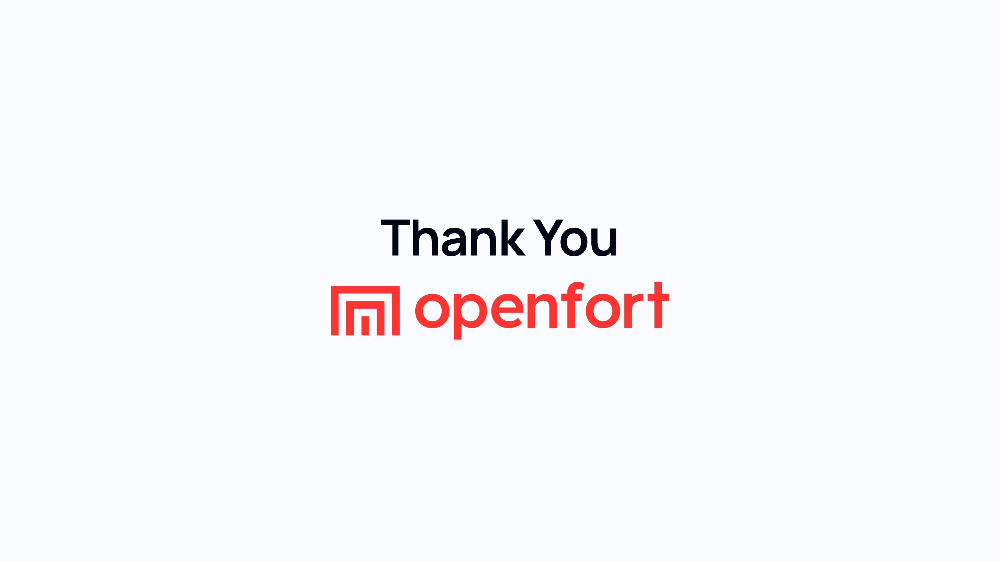

<a href="#slide-13">⬅ Prev</a>

## Key Insights

- **Cheapest Network**: OPTIMISM consistently offers the lowest costs
- **Most Expensive**: MAINNET has the highest transaction costs
- **Gas Consistency**: Gas usage remains the same across networks
- **Cost Savings**: Using OPTIMISM vs MAINNET saves ~99.9% (Total: $22.5287)
- **Price Variation**: Up to 735x difference between most/least expensive networks
- **Total Costs**: MAINNET: $22.5594 | BASE: $0.1741 | ARBITRUM: $2.1136 | OPTIMISM: $0.0307
- **Most Expensive Operation**: "Deploy OPF" ($16.4848 on MAINNET)
- **Most Efficient Operation**: "Register EOA" (222,841 gas)

